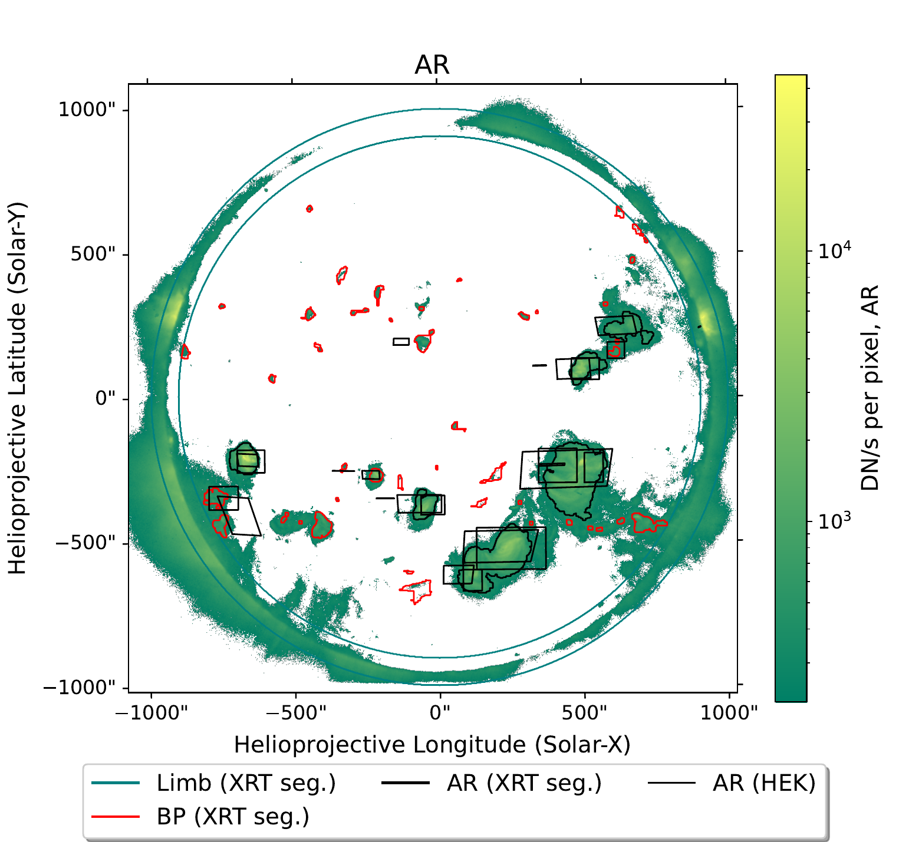
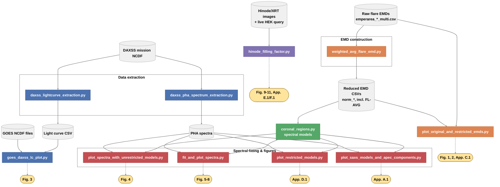

# The Sun as an X-ray Star: SaXS Spectral Modeling

Code accompanying:

> Joseph, W. M., Stelzer, B., Orlando, S., & Klawin, M. (2026). *The Sun as an X-ray star: V. A new method to retrieve coronal filling factors.* Astronomy & Astrophysics, 708, A151.
> DOI: [10.1051/0004-6361/202557814](https://doi.org/10.1051/0004-6361/202557814) · arXiv: [2510.23161](https://arxiv.org/abs/2510.23161)

## Overview

I built spectral models for different kinds of coronal regions on the Sun — active regions, cores, background corona, and flares. Fitting these models to an X-ray spectrum gives you the **filling factor** of each region type: how much of the Sun's surface it covers.

To check whether the models were right, I compared the filling factors they predicted against what those regions actually looked like in real images of the Sun taken at the same time.


*Active-region filling factor predicted from the spectral fit (green), checked against independent region catalogs (HEK, XRT segmentation) on an actual Hinode/XRT image of the Sun.*

## Pipeline flow



## Pipeline & what each script produces

The scripts are organized by pipeline stage, in roughly the order they'd be run:

| Script | Stage | Produces |
|---|---|---|
| `coronal_regions.py` | Core library | XSPEC spectral models for each coronal region type — imported by most other scripts, not run directly |
| `daxss_lightcurve_extraction.py` | Data extraction | DAXSS mission light curve CSV |
| `daxss_pha_spectrum_extraction.py` | Data extraction | Individual DAXSS spectrum PHA files (flare / quiescent) |
| `weighted_avg_flare_emd.py` | EMD construction | FL-AVG: the FFD-weighted average flare EMD |
| `plot_original_and_restricted_emds.py` | Figures | Fig. 1, Fig. 2, Appendix Fig. C.1 |
| `goes_daxss_lc_plot.py` | Figures | Fig. 3 |
| `plot_spectra_with_unrestricted_models.py` | Figures | Fig. 4 |
| `fit_and_plot_spectra.py` | Spectral fitting | Fig. 5, Fig. 6, Fig. 7, Fig. 8 |
| `plot_restricted_models.py` | Figures | Appendix Fig. D.1 |
| `plot_saxs_models_and_apec_components.py` | Figures | Appendix Fig. A.1 |
| `hinode_filling_factor.py` | Image validation | Fig. 9, Fig. 10, Fig. 11, Appendix Fig. E.1, Appendix Fig. F.1 |

Most scripts that produce more than one figure use a `CONFIGS` dictionary near the bottom of the file, with a single `ACTIVE_CONFIG`/`ACTIVE_REGION`/`ACTIVE_PLOT` line to switch which one gets generated — check the top of each script for the specific variable name.

Several figures (noted in each script's own docstring) are saved manually rather than via `savefig()`, since they were fine-tuned interactively before saving. Each script's docstring notes the expected output filename(s) from `paper_plots/`.

## Data

Data files are organized under `data/`:

```
data/
├── emds/      Coronal-region and flare emission measure distribution CSVs
├── spectra/   DAXSS PHA spectra, response/ARF files, DAXSS mission NCDF
├── goes/      GOES X-ray flux NCDF files
└── hinode/    Hinode/XRT images and segmentation maps
```

Within `data/emds/`, filenames follow one convention: `norm_*` files are reduced, ready-to-use single EMD per region (temperature + normalization columns only); `emperarea_*` files are raw, multi-instance data (one column per individually observed flare of that class), used as input when building the flare-averaged EMDs.

This repository starts from the already within-class-averaged flare EMDs (`emperarea_*_multi.csv`) — the raw, unaveraged per-instance flare observations and the code that produces those averaged files are not included here.

**⚠️ All scripts must be run from the repository root.** Every file reference throughout the codebase — EMD CSVs, spectra, images — is a path relative to the repo root, not to the script's own location. This also applies to the PHA files' internal `RESPFILE`/`ANCRFILE` header fields, which XSPEC resolves relative to the working directory the script is run from.

## Setup

Requires [HEASOFT](https://heasarc.gsfc.nasa.gov/docs/software/heasoft/) (for PyXspec) installed and activated separately — it isn't pip-installable. With HEASOFT active:

```bash
pip install -r requirements.txt
python3 check_heasoft_environment.py     # confirms PyXspec/HEASOFT is actually working before running anything else
```

Then, from the repository root:

```bash
python3 coronal_regions.py               # confirms the core library and data load correctly
python3 fit_and_plot_spectra.py          # runs a spectral fit and produces a figure
```

## Known quirks

- **PHA response paths**: the PHA files' headers were edited so `RESPFILE`/`ANCRFILE` point into `data/spectra/` — this only resolves correctly when scripts are run from the repo root (see above).
- **Manual figure saving**: some figures are saved by hand after visual adjustment rather than automatically; see the note at the top of the relevant script.
## License

The code in this repository is MIT licensed (see [LICENSE](LICENSE)).

This does not extend to the figures or data:
- **Figures** (`paper_plots/`) are covered by the CC-BY 4.0 license of the paper itself — reuse requires attribution to Joseph et al. (2026), A&A, 708, A151.
- **Data** (`data/`) originates from other missions and earlier work (Yohkoh/SXT, DAXSS/MinXSS, GOES, Hinode/XRT) and is included here for reproducibility only — its use is governed by the original providers' own terms.
